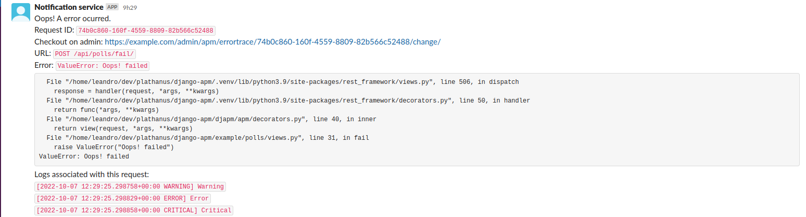
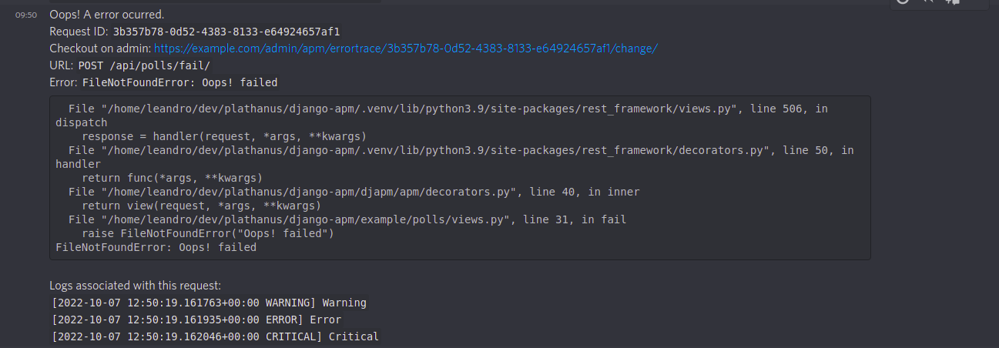
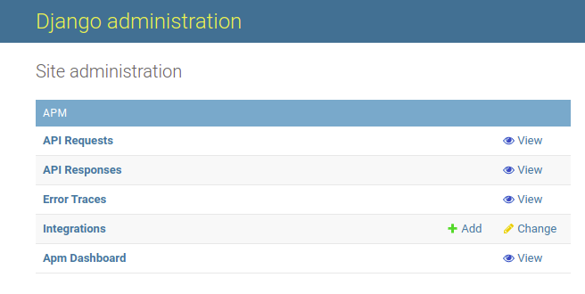
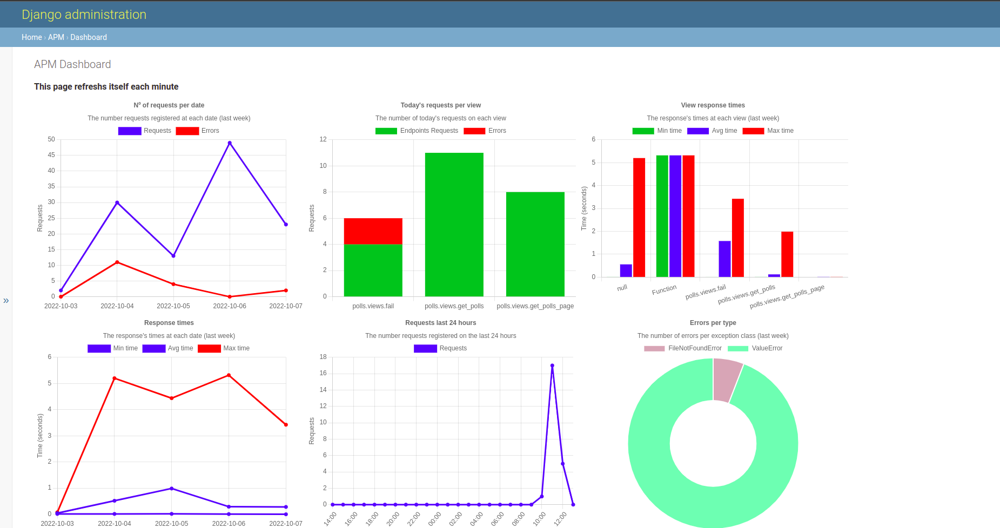
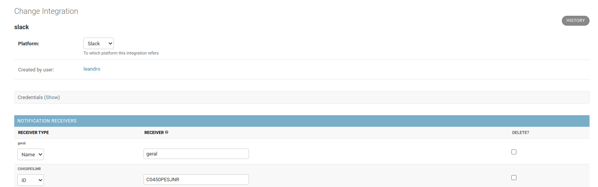
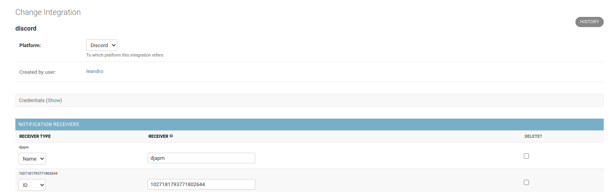

# django-apm

A fully featured APM for django using django.

## Features:

- Know each view is getting more requests/errors;
- Keep track of response times;
- Registers errors and notify you/your team on slack/discord with the exception, traceback and logs;
- Keep track of requests headers/query and payloads (on errors), making it easy to reproduce them in a separate environment.
- Notify your team using celery if desired;

Notifications example:
On slack:

On discord:


## Installation

Install the package using your favorite packaging tool: pip / poetry / pdm, etc.

1.  **Add `djapm.apm.apps.ApmConfig` to `INSTALLED_APPS` in your django settings. Make sure to add it before `django.contrib.admin`.** Otherwise, the dashboard link will not show up in Django admin.
    If you're going to use the `apm_api_view`: Don't forget to add `rest_framework` to your `INSTALLED_APPS`.
    It also requires the `django.contrib.sites` app installed. It must come before the `django.contrib.admin` for the dashboard link show up.

2.  **Adding the middlewares**

    - Adding the ApmMetricsMiddleware middleware (optional).
      If you want to track the requests timing, add the `djapm.apm.middlewares.ApmMetricsMiddleware` to `MIDDLEWARE` in your django settings. Note that this will store into your database **all** requests that use the decorator `apm_api_view` (This decorator is explained later), no cleanup is done. Is up to you to clean the registers periodically if desired. It's better to keep this middleware the **closest to the top** of your `MIDDLEWARE` as possible , this way the `ellapsed` time is closer to the reality.

    - Adding the ErrorTraceMiddleware (optional).
      If you want to track errors and receive notifications, add the `djapm.apm.middlewares.ErrorTraceMiddleware` to `MIDDLEWARE` in your django settings. We recommend that you keep this middleware **closest to the bottom** of your `MIDDLEWARE` as possible. This middleware will notify any exception raised on your view to all integrations added (the setup is explained later).

3.  **Including the URLs**

    `djapm` comes with a dashboard that's accessible through the django-admin. It only allows superusers to view it. To enable the dashboard include the following in your root `urls.py` file:

    ```python
    from django.urls import include

    urlpatterns = [
      # Your other patterns...
      path("apm/", include("djapm.apm.urls")),
    ]
    ```

    Now go to the admin, you should be able to see the dashboard link.
    

    The dashboard shows the data collected from the middlewares. It uses `chart.js` to render the graphics. The data is get from the database via API. Example:
    

4.  **Upgrading your views**
    django-apm comes with 3 decorators: `apm_api_view`, `apm_view` and `apm_admin_view`. Also, it comes with a ClassBasedView: `ApmView` and a ModelAdmin for tracking POST requests: `ApmModelAdmin`. Each of these adds some attributes to the `request`, they are:

    - `id` (`str`): A string UUID4;
    - `logger` (`logging.Logger`): A logger that you can use to log to the sdout and keep track of all logs emitted.
    - `_log_handler` (`djapm.apm.log.ApmStreamHandler`): We use this handler so we can capture all logs emitted by your view; **Do not use this directly**.
    - `_json` (`Any`): An alias to `rest_framework.Request.data` we store this because it's only available at the view, and if not stored, we wouldn't be able to track the payload in the middleware.

    If you enabled the `ApmMetricsMiddleware`, this request and response will be saved to the database. If you enabled the `ErrorTraceMiddleware` any errors uncaught raised by your view will be notified to you. This does not includes the `rest_framework.serializers.ValidationError`, since `rest_framework` itself already handles this exception.

    So, let's get started with each decorator:

    - `apm_api_view`:
      This decorator is an extension of the`rest*framework.decorators.api_view` decorator, so you don't need to wrap your view with the`rest_framework` decorator.

      _Example api view_:

      ```python
      from djapm.apm.decorators import apm_api_view
      from djapm.apm.types import ApmRequest

      @apm_api_view(["GET"])
      def your_view(request: ApmRequest, **kwargs):
           logger = request.logger
           req_id = request.id
           ...
      ```

      **What's changed from the `rest_framework` function-based view:**
      The `request` parameter is now of the type `ApmRequest`, it inherits from `rest_framework.request.Request` so you still have access to all it's attributes.
      You receive a `logger` and a `id` that you can use. The `logger` was created just before your view using a default, if you need to use a different logger you can pass the logger name in the decorator.

    - `apm_view`:
      Add this decorator to all your django regular function-based view's that you want to keep track of.

      _Example django view_:

      ```python
      from djapm.apm.decorators import apm_view
      from djapm.apm.types import PatchedHttpRequest

      @apm_view()
      def your_django_regular_view(request: PatchedHttpRequest, **kwargs):
          ...
      ```

    - `apm_admin_view`:
      Add this decorator to all your django regular admin view's that you want to keep track of.

      _Example django admin view_:

      ```python
      from django.contrib import admin
      from djapm.apm.decorators import apm_admin_view
      from djapm.apm.types import PatchedHttpRequest

      class YourAdmin(admin.ModelAdmin):
          @apm_admin_view()
          def your_custom_admin_view(self, request: PatchedHttpRequest, **kwargs):
              ...

          # don't forget to override the `get_urls` the same way as when you did with your custom view.
      ```

    - The class-based-view (CBV) version:

      If you want to keep track of your CBVs. Inherit the `ApmView` in your view, so we can add the required attributes before your view gets called.

      _Example django CBV view_:

      ```python
      from django.views.generic import CreateView # or any other view
      from djapm.apm.views import ApmView
      from djapm.apm.types import PatchedHttpRequest

      class YourCreateView(CreateView, ApmView):
          ...
          def post(self, request: PatchedHttpRequest, **kwargs):
              ...
      ```

    - The Django Admin POST requests:
      If you want to keep track of your admin model Creations, inherit from `ApmModelAdmin` instead of the regular `admin.ModelAdmin`. Example:

      ```python
      from django.contrib import admin
      from djapm.apm.admin import ApmModelAdmin
      from yourapp.models import AModel

      @admin.register(AModel)
      class YourModelAdmin(ApmModelAdmin):
        ...
      ```

5.  **Running the migrations:**

    Since we rely on the database, you must migrate your database:
    `python manage.py migrate`. This will create these models:

    - `ApiRequest` - Keep tracks of requests, including headers, query parameters;
    - `ApiResponse` - Keep tracks of responses, including status_code, ellapsed time.
    - `ErrorTrace` - Keep tracks of errors on your views.
    - `RequestLog` - Keep track of all logs that were logged from the `request.logger`;
    - `Integration` - Keep track of all your integrations;
    - `NotificationReceiver` - Keep track of all notifications receivers of an integration.

6.  **Create an Integration**
    Now go to the admin, you should now see the models registered there.
    Go to integrations and create at least one integration. Current supported integrations:

    - Slack;
      Uses the Slack App key to send messages through to it's API. Here's a [guide](https://api.slack.com/authentication/basics) on how to create your app and get the key. Scopes required: `channels:read`, `chat:write`. After you get this configured. Install the slack app into the workspace that should send messages. Later, allow/invite the bot to a conversation/channel. When creating the `Integration` on the admin, the slack integration supports both the `name` and `id` of a channel conversation.
      The `name` of the channel is the visible name that appear on slack, note that using the name will require that we fetch the `id` on the slack api.
      The `id` of the channel can be retrieved on Slack. Click with the mouse's right button and click on `Copy` -> `Copy Link`, the `id` is the last part of the URL.
      The same applies for a user.
      
    - Discord;
      Uses a Discord Bot account to send messages through it's API. Here's a [guide](https://discord.com/developers/docs/intro) on how to create your Bot account. Required scopes: `guilds`, `SEND_MESSAGES`.
      When creating the `Integration` on the admin, the discord integration supports both the `name` and `id` of a channel conversation.
      The `name` of the channel is the visible name that appear on discord, note that using the name will require that we fetch the `id` on the discord api. So we need to: Get your Bot `guilds`, for each `guild` get it's `channels` and lookup for a channel with the exact name that was provided. The message is sent to the exact first channel found on any guild, so use a specific name.
      The `id` of the channel can be retrieved on Discord. Click with the mouse's right button and click on `Copy Link`, the `id` is the last part of the URL.
      The same applies for a user.
      

      That's it! You're setup to keep track of your Requests. Also, take a look into the source code `example` folder, that contains a django-project that uses the `djapm` package.

7.  **Optional settings**

    `django-apm` has a set of optional configurations, that can be set on your django settings module. Checkout them below:

    - `APM_DEFAULT_LOGGER_NAME`: The default logger name that will be used if None is supplied to the `apm_view_decorator`. Defaults to: `apm_api_view`;
    - `APM_REQUEST_SAVE_HEADERS`: Boolean that when set to `True` will save the request headers. Defaults to `True`;
    - `APM_REQUEST_SAVE_QUERY_PARAMETERS`: Boolean that when set to `True` will save the request query parameters as json. Defaults to `True`;
    - `APM_REQUEST_SAVE_QUERY_STRING`: Boolean that when set to `True` will save the request raw query string. Defaults to `True`;
    - `APM_NOTIFY_USING_CELERY`: Boolean that when set to `True` will dispatch a celery task when notificating. Since the process of notificating Integration can take a long time, we suggest you to set this to `True`. Defaults to `False`.

## Storage considerations

Since `djapm` uses the database to register, get metrics, this may lead to a lot of storage being used. `djapm` doesn't do cleanups, if you use celery-beat it may be useful to have a scheduled task to do the cleanup. Most of the data displayed on the dashboard is from the last 7 days.

You also may find useful to use a separate database for this metrics, errors.

## Ellapsed time considerations

The ellapsed time displayed, registered is not precise from what your clients may be having. Since we only start keeping track of the time when the request first enters the `ApmMetricsMiddleware`.

## Project Future

- Include support for ViewSets.
